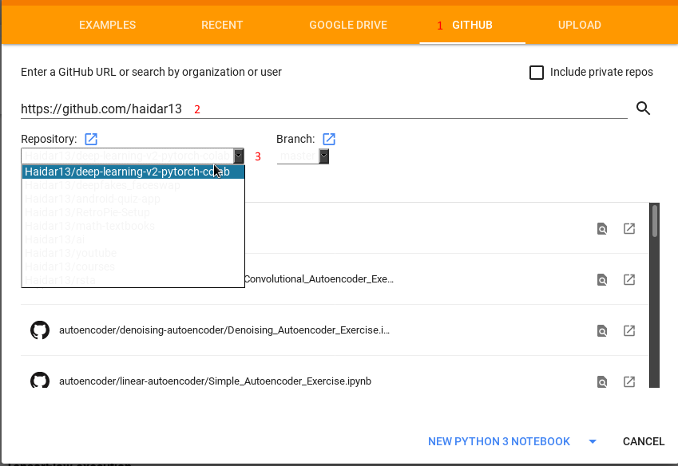
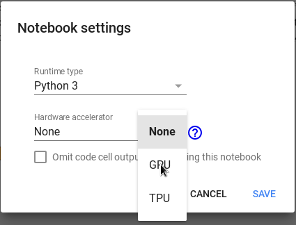
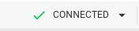
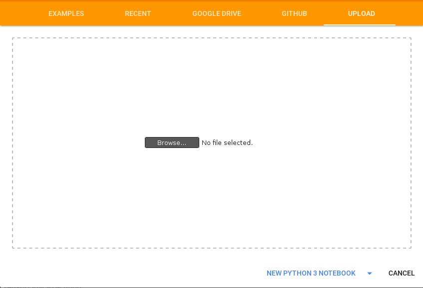

# Deep Learning (PyTorch) using [Google Colab](https://colab.research.google.com)

This repository is a modified clone of [Deep Learning (PyTorch)](https://github.com/udacity/deep-learning-v2-pytorch) which contains material related to Udacity's [Deep Learning Nanodegree program](https://www.udacity.com/course/deep-learning-nanodegree--nd101).

These notebooks are modifed to be ***self-contained to work in colab***. Only the exercises are included (for now) and not the solutions

## Follow these steps to start working in the excercises in colab
* Go to google colab website (https://colab.research.google.com) and sign in
* You will be greeted by this dialog (if not you can use CTRL+o or from file menu select open notebook)

1. select GITHUB
2. For GitHub URL type *https://github.com/haidar13* and click the search button
3. In the Repository drop-down menu select Haidar13/deep-learning-V2-pytorch-colab

* You will get a list of the available notebooks select the on you want to work on and click it to open in colab env

* To work in **GPU** go to the **Runtime menus** select **Change runtime type**

* Change the hardware accelerator to **GPU** and hit SAVE

* If you don't see the green check mark and the word connected at the top right corner of the page click in the connect button and wait for it to connect

***The changes to notebooks from Github will not be saved you need to copy them to your google drive to save any changes made***

### An alternative way: clone the repo or download it as zip file and unzip them to your local machine
* Instead of using the GITHUB tab use the UPLOAD tab and click the **Browes...** button

* Browes to the location where you have the downloaded files and select the file you want to work with

**This way they are saved automatically in your google drive**
